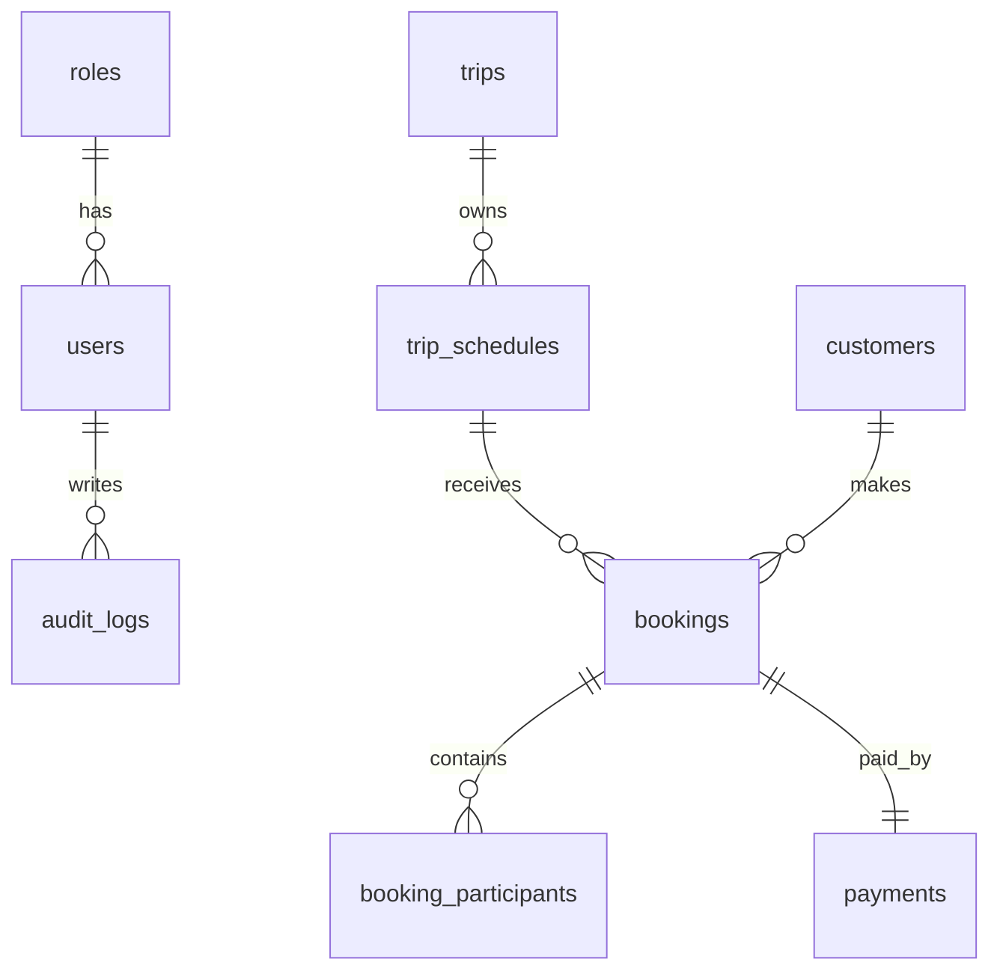

# ERD Database

```mermaid
erDiagram
  roles ||--o{ users : has
  users ||--o{ audit_logs : writes
  trips ||--o{ trip_schedules : owns
  trip_schedules ||--o{ bookings : receives
  customers ||--o{ bookings : makes
  bookings ||--o{ booking_participants : contains
  bookings ||--|| payments : paid_by
```
